# TLPI_learn_note

My notes and solutions for The Linux Programing Interface (TLPI)  
《UNIX/LINUX 系统编程手册》笔记和解答

（代码可以从 README 的超链接或者/Exercise 文件夹下对应章节数字找到）

## Index

- [环境搭建](#环境搭建)
- [CH3 系统编程概念](#ch3-系统编程概念)
- [CH4 文件 I/O：通用的 I/O 模型](#ch4-文件io通用的io模型)
- [CH5 深入探究文件 I/O](#ch5-深入探究文件io)
- [CH6 进程](#ch6-进程)
- [CH7 内存分配](#CH7-内存分配)
- [CH8 用户和组](#ch8-用户和组)
- [CH9 进程凭证](#ch9-进程凭证)
- [CH10 时间](#CH10-时间)
- [CH11 系统限制和选项](#CH11-系统限制和选项)
- [CH12 系统和进程信息](#CH12-系统和进程信息)
- [CH13 文件 I/O 缓冲](#ch13-文件io缓冲)
- [CH14 文件系统](#CH14-文件系统)
- [CH15 文件属性](#CH15-文件属性)
- [CH16 扩展属性](#CH16-扩展属性)
- [CH17 访问控制列表](#CH17-访问控制列表)
- [CH18 目录与链接](#CH18-目录与链接)
- [CH19 监控文件事件](#CH19-监控文件事件)
- [CH20 信号：基础概念](#CH20-信号基础概念)
- [CH21 信号：信号处理函数](#CH21-信号信号处理函数)
- [CH22 信号：高级特性](#CH22-信号高级特性)
- [CH23 定时器与休眠](#CH23-定时器与休眠)
- [CH24 进程的创建](#CH24-进程的创建)
- [CH25 进程的终止](#CH25-进程的终止)
- [CH26 监控子进程](#CH26-监控子进程)
- [CH27 程序的执行](#CH27-程序的执行)
- [CH28 详述进程创建和程序执行](#CH28-详述进程创建和程序执行)
- [CH29 线程：介绍](#CH29-线程介绍)
- [CH30 线程：线程同步](#CH30-线程线程同步)
- [CH31 线程：线程安全和每线程存储](#CH31-线程线程安全和每线程存储)
- [CH33 线程：更多细节](#CH33-线程更多细节)
- [CH34 进程组、会话和作业控制](#CH34-进程组、会话和作业控制)
- [CH35 进程优先级和调度](#CH35-进程优先级和调度)
- [CH36 进程资源](#CH36-进程资源)
- [CH37 DAEMON](#CH37-DAEMON)
- [CH38 编写安全的特权程序](#CH38-编写安全的特权程序)
- [CH39 能力](#CH39-能力)
- [CH40 登录记账](#CH40-登录记账)
- [CH41 共享库基础](#CH41-共享库基础)
- [CH42 共享库高级特性](#CH42-共享库高级特性)
- [CH43 进程间通信简介](#CH43-进程间通信简介)
- [CH44 管道和 FIFO](#CH44-管道和FIFO)
- [CH45 System V IPC 介绍](#CH45-System-V-IPC-介绍)
- [CH46 System V 消息队列](#CH46-System-V-消息队列)
- [CH47 System V 信号量](#CH47-System-V-信号量)
- [CH48 System V 共享内存](#CH48-System-V-共享内存)
- [CH49 内存映射](#CH49-内存映射)
- [CH50 虚拟内存操作](#CH50-虚拟内存操作)
- [CH52 POSIX 消息队列](#CH52-POSIX消息队列)
- [CH53 POSIX 信号量](#CH53-POSIX信号量)
- [CH54 POSIX 共享内存](#CH54-POSIX共享内存)
- [CH55 文件加锁](#CH55-文件加锁)
- [CH57 SOCKET: UNIX DOMAIN](#CH57-SOCKET-UNIX-DOMAIN)
- [CH59 SOCKET: Internet DOMAIN](#CH59-SOCKET-Internet-DOMAIN)
- [CH60 SOCKET 服务器设计](#CH60-SOCKET-服务器设计)
- [CH61 SOCKET 高级主题](#CH61-SOCKET-高级主题)
- [CH62 终端](#CH62-终端)
- [CH63 其他备选的 I/O 模型](#CH63-其他备选的I/O模型)
- [CH64 伪终端](#CH64-伪终端)

## 环境搭建

```bash
    wget https://man7.org/tlpi/code/download/tlpi-201025-dist.tar.gz
    tar -zxvf tlpi-201025-dist.tar.gz
    cd tlpi-dist/
    make
```

```bash
    cd lib/
    sudo cp tlpi_hdr.h /usr/local/include/
    sudo cp get_num.h /usr/local/include/
    sudo cp error_functions.h /usr/local/include/
    sudo cp ename.c.inc /usr/local/include/
```

如果没有静态库的话需要手动创建,现在的新版本并不需要这一步，所以这一步不做

```bash
    g++ -c get_num.c error_functions.c
    ar -crv libtlpi.a get_num.o error_functions.o
    sudo cp libtlpi.a /usr/local/lib
```

运行需要链接 libtlpi.a 静态库

```bash
    g++ main.cpp -o main -ltlpi
```

---

## CH3 系统编程概念

### [3.1 代码](./Exercise/3_1.c)

```c
    #include <unistd.h>
    #include <sys/reboot.h>

    int main(){
        reboot(RB_AUTOBOOT);
        return 0;
    }
```

注意使用 root 权限。RB_AUTOBOOT 是定义在 reboot.h 头文件中的。如果我们换成 RB_POWER_OFF 则系统直接关机。

在其他的 Linux 中，我们也可以使用如下的程序进行重启。(然而我的 Ubuntu 20.04 发行版运行不了，只可以上面方式运行，不过这是发行版和具体版本的问题，毕竟书都过了六七年了。)

```c
    #include <unistd.h>
    #include <linux/reboot.h>

    int main(){
        reboot(LINUX_REBOOT_MAGIC1, LINUX_REBOOT_MAGIC2A, LINUX_REBOOT_CMD_RESTART, 0);
        return 0;
    }
```

这里的 LINUX_REBOOT_MAGIC1、LINUX_REBOOT_MAGIC2A 参数在 linux/reboot.h 中被定义,这些参数是 Linux 的作者 Linus Torvalds 自己和他三个女儿的生日。

我又稍微研究了一下，发现 warning: implicit declaration of function，linux/reboot.h 这个头文件没有声明 reboot 函数，出于别的考虑吧，再说应该用 glibc 的 reboot 比较好吧。写下声明，这样 main 函数内的调用就能找到 reboot 函数了。

```c
    #include <unistd.h>
    #include <linux/reboot.h>

    int reboot(int);
    int main()
    {
        reboot(LINUX_REBOOT_CMD_RESTART);
        return 0;
    }
```

---

## CH4 文件 I/O：通用的 I/O 模型

### [4.1 代码](./Exercise/4_1.c)

没什么难度，就是 getopt 函数学了半天，恼了

### [4.2 代码](./Exercise/4_2.c)

有一个问题，就是无法真正的区分源文件中的连续 0 或是真实的连续空洞。以前的系统中的 cp 命令类似这样实现的，并没有真正的做到复制空洞。但是现在的(我用的 Ubuntu 20.04)已经能处理这种情况，完成正常复制空洞文件了，但是作为练习这种程度已经差不多了，我现在也看不懂源码。。。

---

## CH5 深入探究文件 I/O

### 勘误

首先说下第五章开头那句所有系统调用都以原子方式执行这句话是是错的，只是大部分完全符合原子性，另外一些需要别的措施来保证同步，还有一些系统调用会被信号中断，还有部分中断的系统调用恢复的情况，不能一概而论。而且原子性需要看语义上下文，可以看这个链接有帮助。  
<https://www.zhihu.com/question/46552411/answer/130482168>

### 5.1

要么在所有头文件前(头文件里可能对这个宏有需要)#define \_FILE_OFFSET_BITS 64，要么编译的时候-D_FILE_OFFSET_BITS 64 一样的效果，由于电脑本身就是 64 位，所以看不出效果，如果是 32 位的系统那么就可以突破文件大小 2GB 的限制了。

### 5.2

当然会在最后写入咯，因为 APPEND 之后 write 当然是先改变偏移量到最后，再写入，当然这是一组原子性的动作。(当然 read 不受影响)

### 5.3

多个进程同时写同一个文件的情况，如果没有 APPEND，那么一个进程刚刚 write 后但在更新偏移量前，另一个进程可能在当前偏移量写，从而覆盖，造成文件变小。(代码太简单就没写)

### [5.4](./Exercise/5_4.c)

话说 APUE 也有这道题欸，能用 fcntl 果然舒服多了，虽然那个是直接用 dup 貌似更简单。。。

### 5.5

当然共享，太简单不做了。

### 5.6

书上印刷错误，是" world",所以是 Gidday world

### [5.7](./Exercise/5_7.c)

1. open 文件 O_CREAT 要用八进制或是直接用宏，我一直用十进制。。。服了我自己了。。。🤮
2. 别再误删了。。。不要直接用 vscode 在 ssh 下删除，因为真的找不回，最好 alias rm 变成移动到某个文件夹，因为误删真的太恐怖了，多 commit，不用 push
3. 实现倒是很简单，没啥要说的,另外用不用 tlpi_hdr.h 根本无所谓，我单纯是为了少些几行代码

---

## CH6 进程

### 6.1

bss 区只记录需要多大的空间，但是并不实际分配空间给它，我 ll 和 du 看了，确实占用的空间不关 bss 的事。  
拓展:而数据段是要实际分配空间的，我给全局变量`int a[100000000] = {1}`，虽然只有第一个元素是 1，但这个数组也算是初始化了(不过={0}仍然算在 bss 区，不过这个无所谓啦)，然后 ll 和 du 了一些可执行文件，确实变的很大。

### 6.2

```c
#include <stdio.h>
#include <setjmp.h>

jmp_buf env;

void func()
{
    longjmp(env, 1);
}

int main()
{
    if (setjmp(env) == 0)
    {
        func();
    }

    return 0;
}
```

### 6.3

[我的简陋实现](./Exercise/6_3.c)

---

## CH7 内存分配

### 7.1

可以看见增长幅度挺大的，多次 malloc 只需执行一次 sbrk 系统调用，来提高效率，这种思路非常非常常见。(比如 vector 等等)
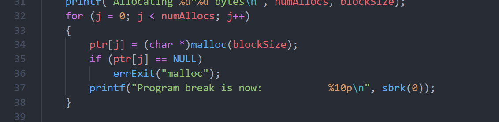


### 7.2

这个完全就是 CMU15-213 的 malloc lab，在那个 lab 中要求你编写一个动态内存申请器（malloc，free，realloc），[我的实现代码](https://github.com/sunhuiquan/csapp_lab/blob/main/malloclab-handout/mm.c)。
我的思路是隐式分离空闲链表，所谓隐式的意思是使用大小来定位前后的块(指针形式叫显式)，分离的意思是有多个有着不同大小范围的链表，每个链表维持着一组在一定范围大小的(2^n-1~2^n)的块，使用 2 的幂，<<1 来快速找到合适的。
合并的思路是看空闲标志位，free 的时候也许前后都是空闲，来合并，根据合并后的大小插入合适的链表中。

---

## CH8 用户和组

### 8.1

显然这个问题本身错了，作者也在勘误中修改了，因为这里的(long)getpwnam("name")->pw_uid 是传递值直接给%ld 了，后面的又不会改变这个值。

```txt
拓展一下：
    当一个函数带有多个参数时，C/C++语言没有规定在函数调用时实参的求值顺序。而编译器根据对代码进行优化的需要自行规定对实参的求值顺序。
    有的编译器规定自左至右，有的编译器规定自右至左，这种对求值顺序的不同规定，对一般参数来讲没有影响。但是，如果实参表达式中带有副作
    用的运算符时，就有可能产生由于求值顺序不同而造成了二义性。
    同样的对于参数有多个函数调用的情况，函数调用的顺序也未定义。
```

我改写一下代码来体先不可重入性。
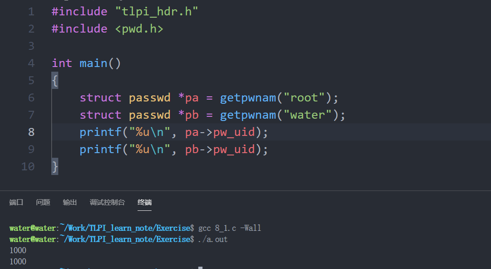

### 8.2

非常简单，[代码](./Exercise/8_2.c)。

---

## CH9 进程凭证

### 9.1

```txt
   real  effective  saved  fs
a. 1000  0          0      0
b. 1000  2000       2000   2000
c. 1000  2000       0      2000
d. 1000  0          0      2000
e. 1000  2000       3000   2000
```

### 9.2

不具有，因为特权只看有效用户 ID(不过因为 real 是 0 很容易回到特权模式)

### 9.3

[my_initgroups.c](./Exercise/9_3.c)

```bash
使用set-root-user-ID，来让程序有权限读取密码文件
gcc 9_3.c -Wall
sudo chown root:water a.out
sudo chmod u+s a.out
```

这个很有意思，因为 get 和 setgroups()函数针对的是调用者 ID(即属主即实际的 ID)，然后 initgroups 还会指定用户名，所以说进程的切换也是挺有意思的，不过 C 风格字符串的操作真是让人头大。

### 9.4

```c
int old_eff = geteuid();
（1）
seteuid(getuid()); // 暂时有效切换到实际
seteuid(old_eff);  // 恢复，因为保存UID的值允许
// 注意多种实现完全都可以，另外setuid和getuid完全作用不同

（2）
setreuid(getuid(),getuid())     // 永久放弃，r不是-1(即使值没变)
// 也会修改保存UID变成有效UID(当然是设置完后的新有效UID)
```

### 9.5

```c
int old_eff = geteuid();
（1）
seteuid(getuid()); // 暂时有效切换到实际
seteuid(old_eff);  // 恢复，因为保存UID的值允许
//此时setuid不能了，因为是特权用户，会把保存UID也改了，所以最好一直用seteuid好用

（2）
setreuid(getuid(),getuid())     // 永久放弃，r不是-1(即使值没变)
// 也会修改保存UID变成有效UID(当然是设置完后的新有效UID)
```

---

## CH10 时间

### 10.1

times 的单位是 sysconf(\_SC_CLK_TCK), (2^32 - x) / sysconf(\_SC_CLK_TCK)  
clock 的单位是 CLOCKS_PER_SEC, (2^32 - x) / CLOCKS_PER_SEC

---

## CH11 系统限制和选项

### 11.1

孩子只有 linux 系统(ㄒ o ㄒ)

### 11.2

ext4 file system:

```c
_PC_NAME_MAX, 255
_PC_PATH_MAX, 4096
_PC_PIPE_BUF, 4096
```

---

## CH12 系统和进程信息

其实如果不是读取/proc 下的文件的话，sysinfo/procfs_pidmax.c 是有 bug 的，因为 write 的字节数如果少于之前的，那么只是单纯覆盖一部分，而剩下的仍然是原来的值，比如 99999 写 123，变成 12399；当然这里并不是 bug，因为读取的/proc 其实是个伪文件系统，并不是普通的文件。不过这写法真的是让我困扰了好一阵。。。不过这个写法真的恶心人啊。。

### 12.1

[代码](./Exercise/12_1.c)本身不难，但是 C 的处理字符串和繁杂程度倒是有点恶心，另外量有点多。。。

### 12.2

[代码](./Exercise/12_2.c)在上一问的基础上改了改完成，另外想要做的好看太难了。

### 12.3

[代码](./Exercise/12_3.c)又是在上一问的基础上修修改改，读写目录，读写链接技能 get🤮。

---

## CH13 文件 I/O 缓冲

### 13.1

[代码](./Exercise/13/13_1.c)  
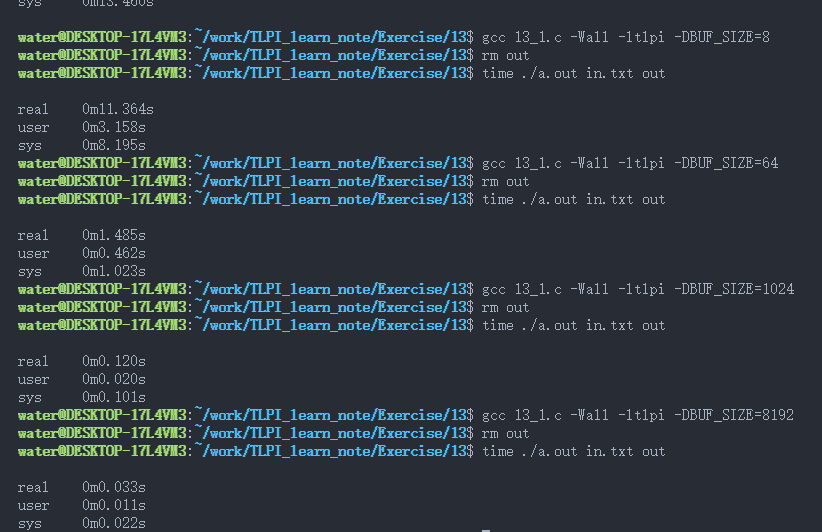  
使用 O_SYNC 使得 write 需要等待内核把数据从高速缓存刷新到磁盘之后才返回,因为实在是太慢了所以直接从缓存大小 1024 开始了
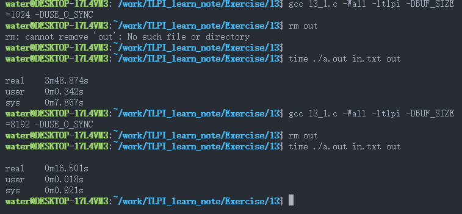

### 13.2

简单 time 测试即可

### 13.3

```c
    fflush(fp);
    fsync(fileno(fp));
```

fflush 是把 fp 流对应的 stdio 缓冲区全部刷新进入内核高速缓存，然后 fsync 是把 fp 对应的 fd 所对应的内核高速缓存(这次 fflush 放入的+之前放入还没刷新的)刷新到磁盘上；如果没有 fflush 只有 fsync 那么只是刷新 fp 对应的内核高速缓存到磁盘，而 fp 对应的 stdio 缓冲区没刷新。

### 13.4

[代码](./Exercise/13/13_4.c)  
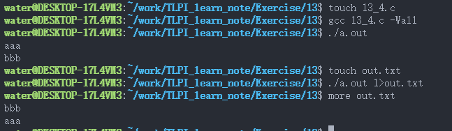

```c
printf("aaa\n");
write(STDOUT_FILENO,"bbb\n",xxx);
```

(1)未重定向
printf 指向终端是所以 stdio 缓冲区是行缓冲，而且有\n，那么 printf 直接刷入内核高速缓存显示，然后 write 写入内核高速缓冲显示,所以结果是

```txt
    aaa
    bbb
```

(2)定向到磁盘文件
printf 指向不是终端而是磁盘文件，所以 stdio 缓冲区是全缓冲，那么 printf 放到 stdio 缓冲区，然后 write 写入内核高速缓冲区显示，这里 stdio 缓冲区也没满，是 return 销毁 main 栈帧后调用 exit，这才刷新 stdio 缓冲区才放到内核高速缓冲的，所以这个顺序的结果是

```txt
    bbb
    aaa
```

### 13.5

[代码](./Exercise/13/13_5.c) 本来以为要 debug 好几次的，结果发现写的竟然直接能跑，惊喜  
lseek 快速定位到文件最后-一个 bufsize 的位置，读入这一个 bufsize，然后倒着顺序遍历检查里面多少个'\n'，不够那么再循环-bufsize，知道 lseek 定位到对应倒数对应行数开头，(文件位置是属于打开文件描述的属性，所以之后直接 write 就是从这个位置属性后开始的)，然后 write 输出即可

---

## CH14 文件系统

### 14.1

我只有 ext4 和 tmpfs,tmpfs 是/run 路径挂载的

```bash
    more /proc/mounts | grep tmpfs
    发现有 none /run tmpfs rw,nosuid,noexec,noatime,mode=755 0 0
```

[这里是代码](./Exercise/14/14_1.c)

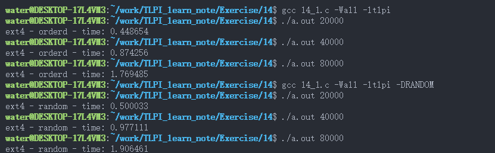  
发现有序建立再有序删除比随机建立再有序删除快  
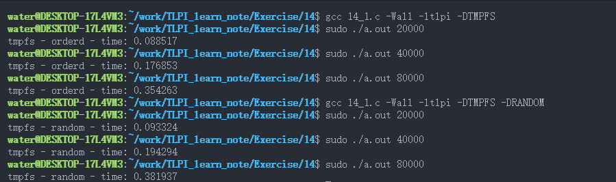  
因为是 tmpfs 是建立再内存上而不是磁盘上的文件系统，所以快非常多，同样符合有序建立再有序删除比随机建立再有序删除快

---

## CH15 文件属性

NOTE: 一个比较有意思的关于 setuid 和 seteuid 的区别，就是 setuid 会把保存用户 id 也设置，这样特权用户就无法恢复了，而 seteuid 不改变保存用户 id 可以恢复，对应的组 id 也是这样

### 15.1

a)只匹配一个，如果用户对应就不管有无权限，不会再检查组和其他的了。


b)  
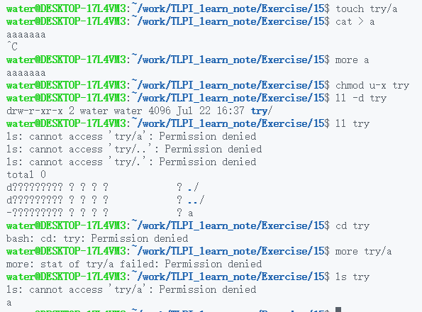

c)

```txt
                         目录     文件
创建文件:                  wx       -
打开读：                   x        r
打开写：                   x        w
删除文件：                 wx       -
重命名：                   wx       -
重命名存在：               wx       -    （会覆盖）
sticky下特殊就是除了要有权限，还要是属主才行
```

### 15.2

当然不会，因为我们是通过 stat 获取信息的，包括获取时间信息，如果改了那么就没意义了。

### 15.3

[代码](./Exercise/15/15_3.c)

### 15.4

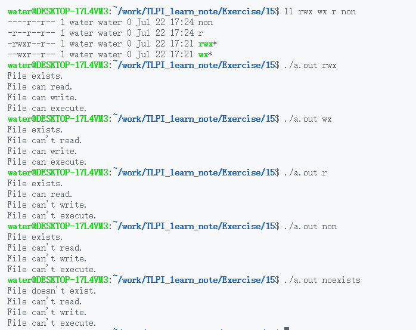

[这是代码](./Exercise/15/15_4.c)
简单地暂时把有效改成实际，检测完再改回来即可。

### 15.5

```c
mode_t old_mode = umask(0);
umask(old_mode);
```

不过这里中间改变了一次，不具有原子性，可以通过加锁来得到。

### 15.6

[代码](./Exercise/15/15_6.c)

### 15.7

[代码](./Exercise/15/15_7.c)

---

## CH16 扩展属性

Note: open 自动解引用，如果不想解引用那么 O_NOFOLLOW 参数，这样如果是符号链接就会返回 ELOOP 错误，阻止打开，所以说 open 产生的 fd 不可能是符号链接文件的。

### 16.1

[代码](./Exercise/16/16_1.c)

---

## CH17 访问控制列表

### 17.1

[代码](./Exercise/17/17.c) 这个是真的够恶心了，首先是确认是数字才能数值转字符串，然后转了但找不到根据 errno 判断是错误还是原本的数字就是名字；然后 ACL 的判断十分复杂恶心，然后需要文件属主和考虑掩码的问题，使用 ACL 的 API，最后根据不同情况判断权限还不能忘记一些情况要考虑掩码问题。

---

## CH18 目录与链接

### 18.1

可以发现 inode 是变了的，说明不是修改了正在执行的二进制文件，而是 unlink 了之前的目录项(当然虽然名称是立即移除了，原进程仍然正常执行，文件是仍然存在的，直到运行结束删除)，然后用了同一个名字(因为刚才刚 unlink 了所以可以)再建立了一个新的文件而已。

### 18.2

symlink()的第一个参数就是要设置给符号链接的内容，然后解释符号链接文件是以链接的路径为基础的，与当前所在目录无关，所以说这个地址应该是以符号链接文件所在位置为基准的地址。

### 18.3

[代码](./Exercise/18/3/18_3.c)
我才直到 fchdir，和 openat 之类的函数的 fd 是只能目录 fd，没我想的那么智能。。。所以 dirname 获取目录，然后得到目录 fd 即可。

### 18.4

[代码](./Exercise/18/4/18_4.c)
无语了，readdir_r 已经弃用了，这里只是为了做题用了下。"This function is deprecated; use readdir(3) instead. -- man page"

### 18.5

[代码](./Exercise/18/5/18_5.c)
C 的字符串处理和没有 STL 容器真恶心，不过没想到标准库里实现了 strrctr 倒序查找。

### 18.6

所谓的先序和后序指分别指的是遇到目录直接处理目录，然后直接进入下一级目录递归处理(这一层不先处理)，处理完最子层之后回到上一层处理，这样；而后序指的是遇到目录则直接进入目录，但先不处理目录，等到下一层全部处理完回到该层的时候再处理目录，这两个都是深度遍历。

### 18.7

[代码](./Exercise/18/7/18_7.c)
需要至少#define \_XOPEN_SOURCE 600 才有 nftw()，另外注意 nftw 一个目录时，里面的..父目录是不含遍历对象中的(显然父目录也不在目标目录内)，而目录自身是含着的(名字是目录真的名字不是'.')。
(这与 readdir 不同，那个分别是'.'和'..')

### 18.8

[代码](./Exercise/18/8/18_8.c)
递归处理绝对路径和相对路径，处理. .. 目录项，真的阴间。

### 18.9

fchdir()在重复调用的情况下速度快，因为 chdir 首先需要在用户态和内核态传递数据即路径名字符串，注意这可不是函数传参传个指针这样,首先系统调用要陷入内核态，在内核态是内核页表，显然访问不到用户态的虚拟内存，所以会传递数据(这样的参数传递数据就是拷贝移动，不过对于大量数据传输的情况下，可以内存映射实现内核空间和用户空间的共享内存完成 IPC)；另外 chdir 需要解析路径名得到 inode，虽然有高速缓存，但显然也要多做一些工作。  
(关于用户态和内核态数据传输，举个最简单的例子，就是 write 把数据写入内核页缓冲，然后内核才能访问这样要写入磁盘文件的的数据，然后刷新线程之后会刷入磁盘，write 就是把用户态的数据(实参数据)传递给了内核(写入内核缓冲区，内核页表))

---

## CH19 监控文件事件

### 19.1

[代码](./Exercise/19/19_1.c)
注意 read 得到的一个 event 里面是可以同时代表多个事件的，这是因为多个同 wd，mask，cookie 的 event 可以合并，这样在生成速度大于消除速度时，可以提高效率减少占用内存，所以是别忘了把每一个要检查的位都要与一下，可能多个符合。

---

## CH20 信号：基础概念

### 20.1

[代码](./Exercise/20_1.c)注意下不要忘了一定要用那两个函数初始化 sa_mask，因为首先自动变量里面是随机值，另外处于实现问题，里面初始化在不同系统实现中可能要求并不是全为 0 的这种初始化，所以 memset 和静态初始化都不行，只能调用那两个函数来初始化信号集变量。

### 20.2

[代码](./Exercise/20_2.c)

### 20.3

SA_RESETHAND: [代码](./Exercise/20_3.c)  
注意下 SA_RESETHAND 调用 handler 前(调用前的意思是改完了还会调用一次 handler)改为 SIG_DEF，因而只调用一次 handler，下一次恢复了 SIG_DEF；但是对于 SIG_IGN 是保持不变，不会改为 SIG_DEF

SA_NODEFER: [代码](./Exercise/20_3b.c)  
这个是 SA_NODEFER 使得可以在信号处理函数中递归调用 hander 自身，执行完返回上一个中断点(在上个调用 hander 的过程中中断的地方)，恢复执行 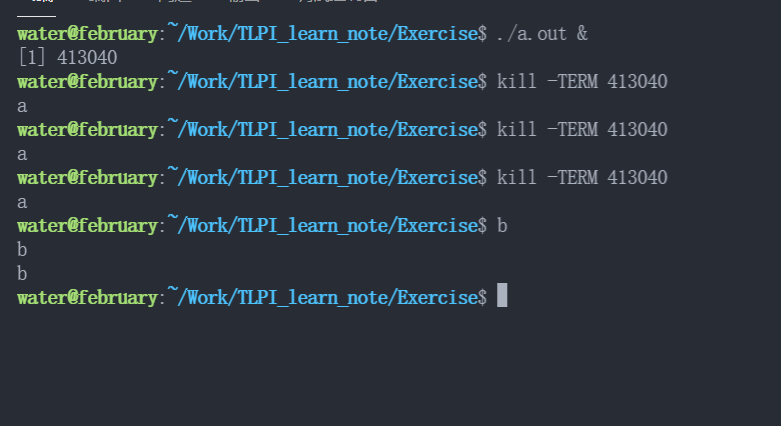  
这是 sa_flag=0 情况  
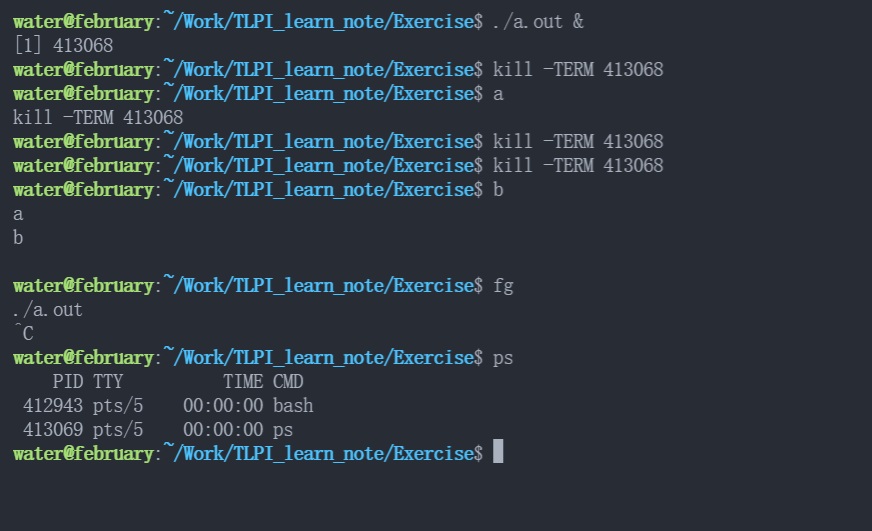

原理图：  
sa_flag=0 情况 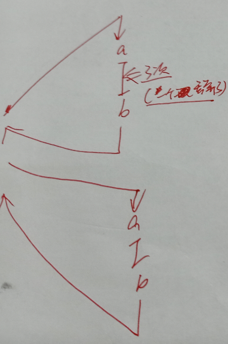  
SA_NODEFER 情况 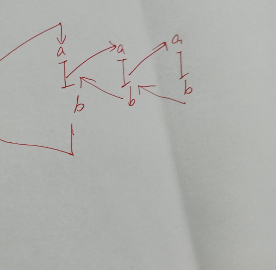

### 20.4 to do

[代码](./Exercise/20_4.c)

---

## CH21 信号：信号处理函数

### 21.1

[代码](./Exercise/21_1.c) 我的实现没有考虑刷新和关闭 stdio 缓冲区，因为看了别人的实现不知道要不要关 STDIN，有点茫然，以后补上。

---

## CH22 信号：高级特性

### 22.1

[代码](./Exercise/22_1.c) 注意：只有信号处理函数调用(和终止)才能中断一个系统调用(前提是这个系统调用可以被中断)，其他如 ignore、stop、cont 不会中断(eg: pause()后 kill-STOP 和 kill-CONT 不会中断 pause，pause 会继续等待被下一个信号中断)

### 22.2

[代码](./Exercise/22_2.c) 标准信号在实时信号前，标准信号顺序非从小到大，实时信号保持从小到大的先后顺序。

### 22.3

[代码](./Exercise/22_3.c)  
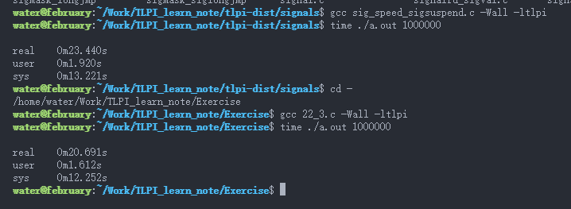

### 22.4

[代码](./Exercise/22_4.c) System V signal API 已废止

---

## CH23 定时器与休眠

NOTE: 400 页书上的代码那里 maxSigs 代码块印刷位置有问题，这种一眼看出来的错都没审出来，有点牛了。

### 23.1

[代码](./Exercise/23/23_1.c) ITIMER_REAL 到时也是产生 SIGALARM 信号正好，不用手动处理信号再 raise 一个 SIGALARM 了。

### 23.2

[代码](./Exercise/23/23_2.c) 第一个使用相对时间，显然高频接受信号导致不断重启的情况下，重启的耗时(这里除了重启还有一些 printf 打印)不消耗剩余时间，造成嗜睡的现象,时间差距是非常非常大的，甚至如果是非常高频(就像这里，由于计时器取整问题，反而 remain 的时间会不断增加,永远也结束不了)，是根本性错误，一定要注意；而采用了 TIMER_ABSTIME 绝对时间，就是自纪元后的一个具体时间点(一个秒数值这样的)，用的是现实中的一个绝对时间点，这样重启的时间就被算入消耗了(因为真实时间在流动)。  
另外 ABSTIME 轻微的延迟是因为唤醒之后等到 cpu 下次调度到这个进程也要一点点微小的时间。

### 23.3

[代码](./Exercise/23/23_3.c)

### 23.4

[代码](./Exercise/23/23_4.c) sigwaitinfo 来同步使用信号(挂起，让信号发生的位置固定，不再是异步信号那样不知道会再哪里处理(从而可能诱发竞争等问题))

---

## CH24 进程的创建

### 24.1

7 个

### 24.2

[代码](./Exercise/24_2.c)

### 24.3

### 24.4

一般先父进程调度，不过这个无法依赖，不同内核版本、不同操作系统的实现都可以是不一样的，而且有可能刚执行父进程有可能就调度了，反而看起来是子进程先行，再强调下无法依赖顺序。

### 24.5

### 拓展

终于明白了 exit 和从 main 中 return 的具体差距，那就是 return 是先析构 main 函数的栈，然后再隐式调用 exit 的，之后 exit 如果再使用 main 函数中的栈的内存就会未定义(比如段错误或者内存对应的值和预期不一样) <这里举个例子就是 return 后析构了 main 的栈帧，然后 exit 会调用退出处理函数，如果这个函数里面用到了之前析构的栈帧的局部变量就会未定义>； exit 直接在 main 中执行，此时 main 的栈仍然正常存在，而 exit 直接完成退出，没有 return 那一步，因此这里没有摧毁 main 栈帧；无论哪种形式退出后，最后再由操作系统来回收资源，如果没有 return 通过改变栈帧相关的寄存器从而释放栈帧，那么这里的 os 来释放所有资源。

[举例](./Exercise/24_6.c)这里用 vfork 举下例子，父子进程共享全部内存，这里头包括栈帧，因此子进程 return 析构了 main 的栈帧，那么父进程如果 return(重新释放一次 main 的栈帧)，或者使用 main 中的自动变量都会未定义。
所以一定要注意，vfork 的子进程中最好不要使用函数返回 return 改变父进程的栈帧导致未定义。

---

## CH25 进程的终止

### 25.1

[代码](./Exercise/25_1.c)返回 255，wait 历史原因一直使用 16 位(返回的 status 状态只有低 16 位用到了)，正常返回的情况下只使用高 8 位，-1 的 16 位是 0x1111 也是 wait 返回的 status 值，但是注意虽然 wait 内部运算返回是 16 位的-1 值的补码，但 status 本身类型是 int，因此在程序看来决定符号的是第 32 位,(((status) & 0xff00) >> 8 得到结果是 0x11，这是 int 最高位是 32 位是 0，因此是正数，所以是 255

---

## CH26 监控子进程

### 26.1

[代码](./Exercise/26_1.c)

### 26.2

父进程被终止变成僵尸进程时子进程被收养。(这是必要的，因为父进程处于僵尸进程的时候是无法 wait 等待子进程的，如果父进程一直处在僵尸进程，那么子进程就算变成僵尸进程也无法被 wait 回收，因此当父进程变成僵尸时，子进程就是孤儿进程了，然后被 init 进程收养，然后 init 进程定期回收已终止的孤儿进程)
(ps.写的代码 git 忘提交后误删了，吐了，实现很简单就是 sleep 打个时间差，然后在不同阶段让子进程打印父进程 id 即可)

### 26.3

[代码](./Exercise/26_3.c)看了看内部是一个联合 union 节省不同情况下的结构空间，有点意思，另外 si_status 是一个宏，难怪 vscode 没有自动填充，另外这个宏覆盖了我手动写的 si_status，导致出错，吐了 🤮，代码倒是很简单

### 26.4

sleep 确实是不安全的,因为如果在高负载或者特殊情况下，是有可能到了时间另外的进程也没执行完的。(另外就是 sleep 这个方式实际生产中也根本没用，因为休眠太浪费资源了，时间不好把控，而且还不安全)  
[代码](./Exercise/26_4.c)  
有点意思的就是通过全局变量标志来忽略其他信号，只有 SIGCHLD 信号到达才退出循环往下运行。

---

## CH27 程序的执行

### 27.1

exclp()调用，xyz 中不含有/所以是只查找 PATH 路径，PATH 路径的查找方式是按顺序查找到第一个地方，之后就不查找了，所以这个查找到的是在 PATH 里面靠前的./dir1/xyz，因为权限没有 x，所以无法执行，错误退出
（ps.重点就是 PATH 中顺序查找，找到第一个就完成了，不会再找第二个）

### 27.2 to do

[代码](./Exercise/27_2.c)

### 27.3

[代码](./Exercise/27_3.c) [脚本](./Exercise/27_3.sh)


### 27.4

与单次 fork 相比，最大的好处就是产生了一个被 init 收养自动被回收的进程，这样就可以不用考虑子进程的回收问题了，一些情况下可以大大降低问题的难度。两次 fork(父、子、孙进程)通过子进程的退出，使得孙进程被 init 收养，终止后自动被回收，父进程因为子进程直接退出也不用考虑在一些情况下会变得复杂的 wait 回收。

### 27.5

printf 没有重定向的情况下与终端关联，是行缓存的，所以先缓存到了用户态的 stdio 缓冲区，后面的 execlp 是加载新的程序到内存里面，会把当前进程的各种内存给覆盖掉，包括这个用户态的库函数里面的这个 stdio 缓冲区也被覆盖了，所以之前的缓存区的内容也没了。

### 27.6

[代码](./Exercise/27_6.c)
wait 自然会回收终止的僵尸子进程，解除阻塞后 pending 的 SIGCHLD 就会让进程接受 SIGCHLD 信号了。调用 system 的程序里面阻塞了 SIGCHLD 来完成正确的子进程回收，之后解除阻塞后调用 system 的程序会收到之前阻塞的一个 SIGCHLD 信号(pending 没有计数，无论阻塞过程中收到多少，pending 只是标志了收到过)，这里需要明确并做好相应的信号处理。

注意：exec 执行脚本的参数好奇怪:

```txt
    对于执行解释器脚本的exec系统调用，自动舍弃argv[0]，而使用的是脚本名作为第三个参数，
    第一第二个分别是解释器的绝对路径(从#!起始行获取)，和起始行(#!这行的参数)，
    这三个参数都是操作系统自动实现的，当exec发现#!就知道这是解释器脚本要用解释器运行了
    如果没#!写明要用的解释器的位置，那么自动使用/bin/sh解释器来解释这个脚本
```

注意：感觉这个好重要，书上怎么只说了子进程终止会发，没说其他情况会不会发。

```txt
    子进程状态变更了，例如停止、继续、退出等，都会发送SIGCHLD信号通知父进程。
```

---

## CH28 详述进程创建和程序执行

---

## CH29 线程：介绍

### 29.1

ERROR [EDEADLK/EDEADLOCK Resource deadlock avoided]这是在 linux 下发生的；当然其他 UNIX 系统可能会发生死锁（因为 pthread_join(pthread_self(),NULL)会阻塞直到等待的线程退出，而这个等待的线程正是它本身。它本身需要执行完 pthread_join 才可以退出，而 pthread_join 解除阻塞又需要退出，显然矛盾，发生死锁。）

```c
if(!pthread_equal(tid, pthread_self())) // 确保tid不是该线程自己的POSIX thread id
    pthread_join(tid, NULL); // 另外一定是要用pthread_equal来确保可移植性
```

### 29.2

主线程退出后主线程栈的内存之后会被重用，而创建的线程使用的指针指向已经被重用的原主线程栈的内存空间，这种行为未定义，可能造成严重后果

---

## CH30 线程：线程同步

### 30.1

[代码](./Exercise/30_1.c)单纯熟练下 API，随便写写

### 30.2

[未完成代码](./Exercise/30_2)写楞了，怎么保证线程安全啊。。越想越搞不懂，也没写测试，只是写了写大概思路，等以后再搞一下。

---

## CH31 线程：线程安全和每线程存储

### 31.1

[代码](./Exercise/31_1.c)利用互斥量实现 pthread_once

### 31.2

[代码](./Exercise/31_2)使用线程特有数据，避免了多个线程共享传入的 pathname 内存导致线程不安全。(由于 basenae 函数和 dirname 的代码大体一样，所以就写了一个,不过使用线程局部数据简单代码简单多得多)
简单试了试线程特有数据和线程局部存储这种方式，通过宏的方式都测试了下，写了个 Makefile(以后有空再修改下，这个写的太垃圾了，头疼。。)

---

## CH33 线程：更多细节

### 33.1

待做，部分前置章节没看完。

### 33.2

不会，因为信号发送目标是进程，而 NPTL 已经非常接近 POSIX 标准，因而各线程共享进程 ID，因而某一个线程 fork 产生的子进程，发送 SIGCHLD 信号目标是父进程 ID，而线程共享这个进程 ID，因而可能发给该进程下的所有线程。

---

## CH34 进程组、会话和作业控制

### NOTE CH34

注意挂起(Ctrl+z)/阻塞(比如I/O处理)/休眠状态(sleep)是S(这三个是一个东西)，而停止(SIGSTOP)状态是T，完全是另外一种东西；前者仍能处理信号，而后者不能，信号到来会放到pending，只有SIGCONT恢复后才可以从pending取出信号处理。  
因为停止的时候不能处理信号，这样之前处于停止的进程，当会话控制进程断开与控制终端联系，内核发给控制进程SIGHUP和SIGCONT，控制进程一般是shell，会处理这个SIGHUP信号，会发给会话的其他所有进程，而如果之前处于停止的进程收到SIGHUP会放到pending而无法处理，所以不能单发一个SIGHUP，而是发SIGHUP和SIGCONT来处理这种情况。

### 34.1

### 34.2

[代码](./Exercise/34/2/main.c)

### 34.3

[代码](./Exercise/34/3/main.c)

### 34.4

[代码](./Exercise/34/4/main.c)

### 34.5

### 34.6

[代码](./Exercise/34/6/main.c)

### 34.7

[代码](./Exercise/34/7/main.c)

---

## CH35 进程优先级和调度

### NOTE

外面比较的是 CPU 时间，现实时间根本和进程能占据 CPU 使用 CPU 的时间没关系，因为不同载荷的情况下现实时间一点作用都没有，所以用 CPU 时间看性能。

### 35.1

[代码](./Exercise/35/1/main.c)

### 35.2

<!-- to do set-user-ID-root程序忘记怎么写了，以后补上 -->

### 35.3

[代码](./Exercise/35/3/main.c) CPU 时间是用户进程 CPU 时间和内核 CPU 时间之和，注意这是这个进程的 CPU 时间，不是实际时间，因为 Linux 是分时多任务系统，所以显然现实世界的一块时间的一小部分才是这个进程占据 CPU 为己所用的时间。  
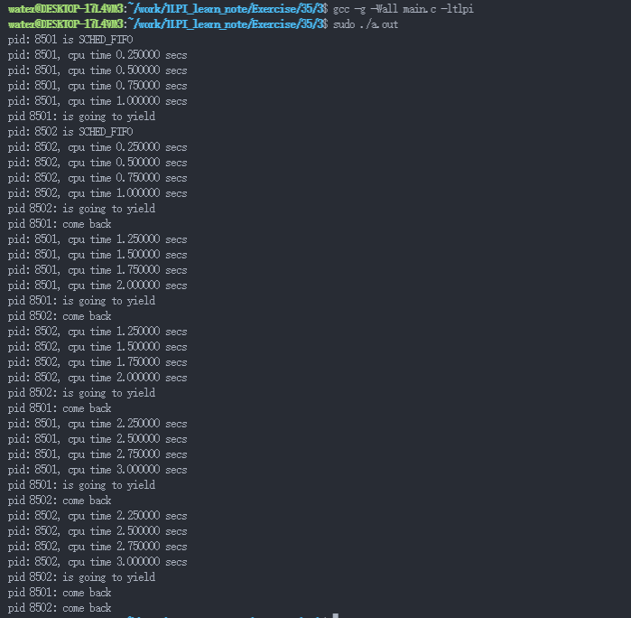 我真是弱智，忘记了多核处理器并行的问题，确实实时的 FIFO 调度策略占据了一个核心，但是还有另外 7 个处理器核心呢，就是普通的 OTHER 进程也正常地运行着呢，另外也不想想如果真的只有一个核心跑了那个进程，那我不就死机了吗，无语，所以说别忘了设置 CPU 亲和力。

### 35.4

[代码](./Exercise/35/4/main.c) 管道(匿名)或者 FIFO 文件就是一块内存，和硬盘没任何关系，和共享内存本质基本一样，只是外在行为不一样。  
同 CPU 这样 CPU 高数缓冲器更好的利用，不同 CPU 为了一致性还需要失效缓冲的内容，降低效率。  
注意，比较的时间一定是花费的 CPU 时间，因为不同 CPU 跑的时候，并行当然更快，花费的现实时间当然少，但是 CPU 时间是增加的。(就是效率低了，但多用了一个 CPU 核心并行，本质上是浪费效率了(因为原本多一个 CPU 可以跑别的，原本是 1 个跑 1.5s，现在是两个各跑 1s，少了 0.5sCPU 时间这样))  
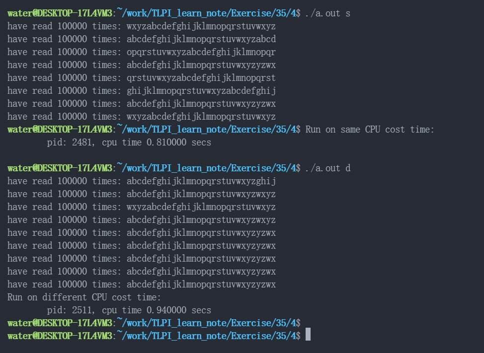

---

## CH36 进程资源

注意:
RUSAGE_CHILDREN
Return resource usage statistics for all children of the
calling process that have terminated and been waited for.
These statistics will include the resources used by
grandchildren, and further removed descendants, if all of
the intervening descendants waited on their terminated
children.
manpage 上写的多清楚，书上一开始写的有点误导(虽然后面仔细说明了)

### 36.1

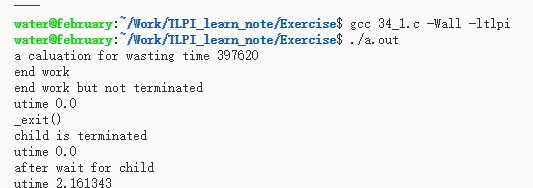  
[代码](./Exercise/36_1.c)  
可以非常明显地看出子进程的资源使用信息，是在它被父进程 wait 调用的时候更新的，因而无论是正在运行还是终止都不会记录信息，只有被 wait 后才有(SIG_IGN 处理 SIGCHLD 也不会有信息)。

### 36.2

[代码](./Exercise/36_2.c)

### 36.3

[代码](./Exercise/36_3.c)  
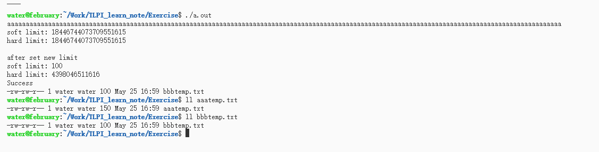  
可以发现超出文件大小软限制的情况下 write 并没有报错，errno 也没有设置出错，但是写入的大小超出 RLIMIT_FSIZE 的部分被截断舍去。

---

## CH37 DAEMON

---

## CH38 编写安全的特权程序

---

## CH39 能力

---

## CH40 登录记账

### 40.1

[代码](./Exercise/40/40_1.c) 里面使用了 ttyname，getutxent 都是不可重入函数，所以调用这个答案会影响这两个静态区，同样这个答案也是不可重入的。

### 40.2

[代码](./Exercise/40/40_2.c) 搞不懂那个 non_string 属性,不过写完了

### 40.3

[logwtmp 函数](./Exercise/40/40_3.c)  
另外登录登出有点复杂暂略(不过里面更新登录记账日志的部分很简单，复杂的内容和本章无太大关系)

### 40.4

[代码](./Exercise/40/40_4.c) WSL 下和 who 有点差别，不知道实际有没有

---

## CH41 共享库基础

### CH41 NOTE

首先使用共享库，是要先执行静态链接(编译生成可执行文件的时候)再执行动态链接(运行的时候)的，而静态库则只有静态链接。  
然后注意静态链接的时候要(-L)指定链接库路径(不管是静态还是动态库，默认搜索路径是/usr/lib /lib /usr/local/lib(ubuntu 可以)等);然后要运行程序动态链接的时候也要指定动态库的路径(这个自带的路径挺奇葩的，/usr/lib /lib 都有，但我电脑/usr/local/lib 却没有，明明静态链接的默认搜索路径是包含的，说明这两个没啥关系)，当然还有个写在/etc/ld.so.conf 里面的也是默认搜索，不过注意这个能找到前提是你先运行过 ldconfig 生成好索引了，我把/usr/local/lib 写入 ld.so.conf 然后运行了下 ldconfig 就好了。

### 41.1

[代码](./Exercise/41) 为了方便，没有弄 soname 和链接器名字等一堆事情  
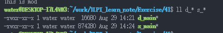

---

## CH42 共享库高级特性

### 42.1

[代码](./Exercise/42/42_1.c) 别忘了开个 GLOBAL 让后面 mod2 可以依赖 mod1,以前 dlopen 是自动导入共享库所依赖的共享库的，现在改了不行了无语

### 42.2

[代码](./Exercise/42/42_2.c)

---

## CH43 进程间通信简介

---

### 43.1

[代码](./Exercise/43_1.c) gettimeofday 做差提供高精度的时间差，用于计时挺好用的。

### 43.2

to do

---

## CH44 管道和 FIFO

### 44.1

[代码](./Exercise/44_1.c) 写了半天，C 风格字符串真的恶心，总是不知道有没有必要处理'\0'，吐了。。一不小心把 pipe 写在 fork 后面，分别创建了两个管道，我还傻傻查了半天错。。。

### 44.2

[代码](./Exercise/44_2.c) 在库函数里面用了全局变量来处理该等待哪个子进程，static 用了

### 44.3

[代码](./Exercise/44_3456/44_3.c) 把代码放到 fifo_seqnum_server.c 后，make all 生成可执行文件。

### 44.4

[代码](./Exercise/44_3456/44_4.c) 复习一下 unlink，unlink 的作用是立即删除硬链接(文件表项)，并减少 inode(文件本身)的引用计数(只有硬链接算，软链接不是)，当 inode 引用计数为 0 时真正删除文件本身。但是注意即使引用计数为 0，但如果仍有打开文件描述符(本质是通过 open 系统调用)指向 inode 项，那么先不删除 inode(因为删除 inode 之后打开描述符就什么也干不了)，这样不会影响已经打开的描述符，直到所有打开描述符关闭后，inode 才被删除。(ps. inode(文件本身)的引用计数是硬链接)

另外因为 SIGINT 和 SIGTERM 两个信号用了同一个信号处理函数，为了避免一个信号中断调用 handler 的时候又被另一个信号中断调用同一个 handler 造成一些困扰，最典型的是造成竞争条件(虽然 handler 本身要求最好是可重入，这种情况不受影响)，或者因为要退出并做一些清理工作，会造成退出前做了多次清理工作的 bug，因此为了避免这个当一个信号中断的时候要把掩码加上别的共用同一个 handler 的信号。

```txt
unlink(2) — Linux manual page:
 unlink() deletes a name from the filesystem.  If that name was
       the last link to a file and no processes have the file open, the
       file is deleted and the space it was using is made available for
       reuse.

       If the name was the last link to a file but any processes still
       have the file open, the file will remain in existence until the
       last file descriptor referring to it is closed.

       If the name referred to a symbolic link, the link is removed.

       If the name referred to a socket, FIFO, or device, the name for
       it is removed but processes which have the object open may
       continue to use it. (这种情况下和对普通的file操作没区别)
```

### 44.5

在服务器关闭和重新打开 server 的 FIFO 之间,如果 client 写打开 FIFO 会错误，导致请求失败。

### 44.6

[代码](./Exercise/44_3456/44_6.c)
[阻塞攻击代码](./Exercise/44_3456/fifo_seqnum_bad_client.c)
使用轮询，正常情况下即使 server 在 client open FIFO 前打开，也会在 20000 次以内 client open FIFO，阻塞攻击的情况下，20000 次仍失败则处理下一个请求,通过打印基本可以肯定在 20000 时几乎没问题,这样超出 20000 我们认为是攻击会退出后处理下一个请求(可以设大一点因为打开成功后就 break 实际上不会跑这么多次，对于阻塞攻击多给些时间来确保也是正确的)

### 44.7

[代码](./Exercise/44_7.c) 这个简单，舒服了

note: 只有 exit()和从 main 中 return 调用退出注册函数，被信号异常终止和\_exit()不调用。

---

## CH45 System V IPC 介绍

### 45.1

[代码](./Exercise/45_1.c) 非常容易，顺便复习下 stat 写法

### 45_2

[代码](./Exercise/45_2.c) 和练习一没啥区别

### 45_3

首先注意一下如果是 IPC_PRIVATE 作为 key 创建的标识符显示是 0.
[代码](./Exercise/45_3.c) 公式符合，但是 seq 字段的行为不同，是因为 linux 内核升级改变了计算的方式，吐了，我还以为我错了。
发现 ipcrm 的参数也变了，变了不少。。。

---

## CH46 System V 消息队列

注意： A successful close does not guarantee that the data has been
successfully saved to disk, as the kernel uses the buffer cache
to defer writes.
所以说 close 不保证立即写回磁盘，记得 O_SYNC 之类的标志。

注意：自定义类型中 long 之后可能出现字节对齐导致的 padding bytes，这种情况下通过 offsetof 或者整个 sizeof - sizeof(long)可以得到真实的剩余部分的所占用空间，在自定义消息类型的 mtext 的大小十分关键。
[举例](./Exercise/46_0.c)

注意：打开作用的 msgget 的权限完全可以不写，只是单纯检测是否拥有权限，对后面实际拥有的权限没有任何影响，不过这个检测挺方便的。

注意：发现个有意思的地方，那就是命令行中输入的参数如果是"a"会自动忽略""，要\"转义才不会被 shell 忽略。

### 46.1

[代码](./Exercise/46_1)

### 46.2

[代码](./Exercise/46_2)

### 46.3

因为有些参数的功能使用的消息类型来确定选择顺序，当然不能用了。

### 46.4

to do(仅完成第一问)

### 46.5

to do

### 46.6

to do

---

## CH47 System V 信号量

### 47.1

[代码](./tlpi-dist/svsem/svsem_op.c)

### 47.2

[代码](./Exercise/47/47_2.c)

### 47.3

[代码 a](./Exercise/47/47_3a.c)  
[代码 b](./Exercise/47/47_3b.c)  
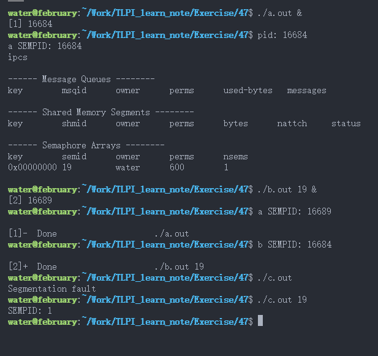  
可以看出来其实 UNDO 本质上就是一次取相反值的 semop 操作，因为进程终止的时候做的撤回操作，同样会改变 SEMPID 的值。

### 47.4

[代码](./Exercise/47/47_4.c)

### 47.5

[代码](./Exercise/47/47_5)

### 47.6

[代码](./Exercise/47/47_6) fcntl 设置 FL 是文件状态标志，文件描述符标志才是 FD 而且现在就一个 CLOSEXEC 这一个

### 47.7

[代码](./Exercise/47/47_7.c) 和 System V 消息队列基本一样用法，SEM_INFO 前两个参数都设成 0，因为这是总体的资源限制一个属性，放到 arg.\_\_buf，返回是最大正在用的下标；SEM_STAT 把信号量集的相关结构放到 arg.buf，里面有对应该信号量集的属性，参数是所在下标，返回标识符；从 0 开始到最大下标遍历，中间可能有不存在 EINVAL(因为中途删除了该下标，同时还没来得及被重用的时候)和 EACESS(没有读权限(某些操作系统连读权限都不需要))，记得忽略这两个错误，根据 SEM_STAT 获取相关下标元素的属性来打印。

---

## CH48 System V 共享内存

### 48.1

[代码](./Exercise/48/48_1) 没想到 tlpi 里面有 eventFlag 和我的头文件名字相同，makefile 没写明白一开始用的是他的实现，无语了，虽然结果一样，后来手动链接的。。。我一定以后好好学一些 c/c++的链接问题。。。

### 48.2

因为 bytes += shmp->cnt 这个操作放在了信号量保护的区域之外，而 shmp->cnt 是被多个进程共享的，如果没有同步保护机制会发生竞争条件。具体来说这里就是当 write 后释放了写者信号量，如果在更新 bytes 前调度到另外的进程，更新了 shmp->cnt 这个共享变量，当再度返回更新 bytes 时就会使用错误的 shmp->cnt 的值，出现竞争错误。

### 48.3

[代码](./Exercise/48/48_3)

### 48.4

[代码](./Exercise/48/48_4)

### 48.5

to do

### 48.6

[代码](./Exercise/48/48_6.c) 和之前的 System V 的消息队列和信号量的操作基本一样，就是别忘了忽略 EINVAL 和 EACESS 这两个错误。

---

## CH49 内存映射

### 49.1

[代码](./Exercise/49/49_1.c)

### 49.2

[代码](./Exercise/49/49_2)

### 49.3

[代码](./Exercise/49/49_3/test.c) 注意超过全部界限不一定是 SIGSEGV，这是未定义的(看你具体访问到哪个地方了)

### 49.4

[代码](./Exercise/49/49_4)

---

## CH50 虚拟内存操作

### 50.1

[代码](./Exercise/50/1.c)

### 50.2

[代码](./Exercise/50/2.c)

---

## CH52 POSIX 消息队列

note: 千万注意要用 mq\_的系列函数，比如 mq_unlink 才会删除，而 unlink 是不会删除的。

note: timespec 是秒和纳秒，clock_gettime 对应 timespec，注意如果是用绝对时间做定时，要把定时的时间加上当前时间。

note: 一个消息队列对象是发送和接受同一种类型的(这样才能正确解析)，所以 msgsize 可以设置成要发送的消息的大小，同时用 attr.msgsize 作为 receive 的参数(必须是大于等于这个的，否则会 EMSGSIZE 错误，因为可能无法接收可能到来的最大的消息)；不同消息队列的对象可能用的类型不一样，比如 server 客户发送请求和服务器解析请求，client 服务器发送响应，客户接受响应，注意同一个消息队列对象的发送和接受的类型是一样的。

### 52.1

[代码](./Exercise/52/52_1/52_1.c)

### 52.2

[代码](./Exercise/52/52_2)

### 52.3

[代码](./Exercise/52/52_3)

### 52.4

to do

### 52.5

[代码](./Exercise/52/52_5)

### 52.6

[代码](./Exercise/52/52_6)

### 52.7

linux 中实现是创建新线程来处理通知，如果一个线程处理完前，多个通知到来，导致多个线程并发处理通知，但由于使用了共享的全局变量 buffer，会导致竞争问题。

---

## CH53 POSIX 信号量

### 53.1

[代码](./Exercise/53/53_1/posix_thread_xfr.c)

### 53.2

[代码](./Exercise/53/53_2) 别忘了删除(unlink 或者在/dev/shm 删除对应(注意我们的/name 会自动转换未 sem.name 的虚拟文件名))

### 53.3

to do

### 53.4

[代码](./Exercise/53/53_4)
Machine： AliCloud-ECS Linux-Ubuntu 20.04 2G 4cores
thr-num mutex ratio posix ratio systemV
1 0.002 1.5 0.003 39 0.117
4 0.013 8.1 0.105 36 3.826
16 0.079 8.3 0.659 2.4 16.05
可以发现，当线程并发程度增加(冲突的比例上升)的时候，posix 和 system V 信号量的比例在下降，这是因为 posix 只是在出现冲突的时候调用系统调用，而 system V 总是调用系统调用，当并发程度上升，posix 调用系统调用的比例上升(即轻松的工作比例下降，重活比例上升)，而 system V 一直是调用系统调用(全是重活的比例)，所以会导致比值下降。

---

## CH54 POSIX 共享内存

NOTE：注意 mmap 的读需要用读方式打开，写则要求读写模式打开共享内存段，而 ftruncate 与访问权限无关。
NOTE：注意 ftruncate 是对共享内存段操作，所以说 shm_open 创建的时候初始化共享段大小，之后打开是根本不需要的。
NOTE：有点不适的是对于 shm_open 关闭是 close，而删除又是 shm_unlink，虽然我知道这是因为 close 实现已有，但还是感觉有点乱。(例如 xx_unlink 不同与 unlink 哦，普通的 unlink 删除无效的)

### 54.1

[代码](./Exercise/54_1) 注意 mmap 的权限是 PROT_XX 的格式，打开权限是 O_XX，文件模式是 S_IXX，这些宏的值都不一样，别再搞错了。。。

---

## CH55 文件加锁

### 55.1

- 55.1.a
  [代码](./Exercise/55/1) 可见连续不断的读(共享锁会造成写(互斥锁)饥饿)  
  

- 55.1.b
  <!-- to do   -->

- 55.1.c
  LINUX 和大部分 UNIX 都是这样，至于少部分的 UNIX 我是不知道了。

### 55.2

[代码](./Exercise/55/2) 证明确实 flock 文件锁不像记录锁一样会检查死锁  
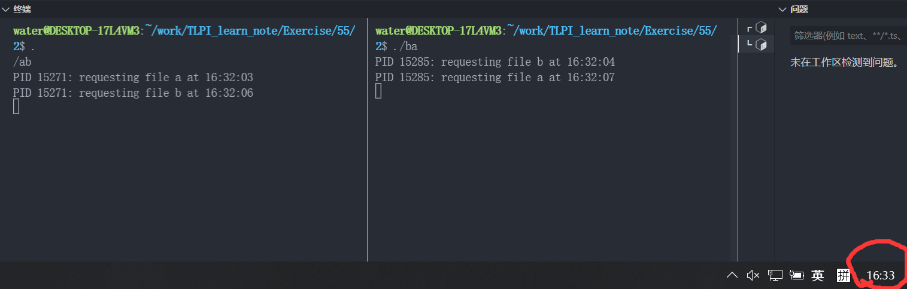 发生死锁了，休眠只有 3s，但已经过了好几分钟了

### 55.3

[代码](./Exercise/55/3)

### 55.4

[代码](./Exercise/55/4/main.c) 运行可以看出 flock 文件锁和 fcntl 记录锁互相是不可见的(在 linux 上)，一点相互影响都没有(当然一些 UNIX 用 fcntl 实现 flock 的不是这样)。  
我犯了个弱智错误，flock 文件锁 open 给个 read 权限就都行了，互斥锁不需要；而 fcntl 记录的读、写锁需要对应 open file 的权限，不然会 EABDF 错误。

### 55.5

[代码](./Exercise/55/5) 循环用来放大倍速便于观察,发现的确是线性  


### 55.6

[代码](./Exercise/55/6) 可见连续不断的读(共享锁会造成写(互斥锁)饥饿)

### 55.7

无 UNIX 环境，所以没做，不过 UNIX 平台实在太多了，各有不同，谁知道会发生什么呢。。。

### 55.8

[代码](./Exercise/55/8) 三个文件的依赖链导致死锁
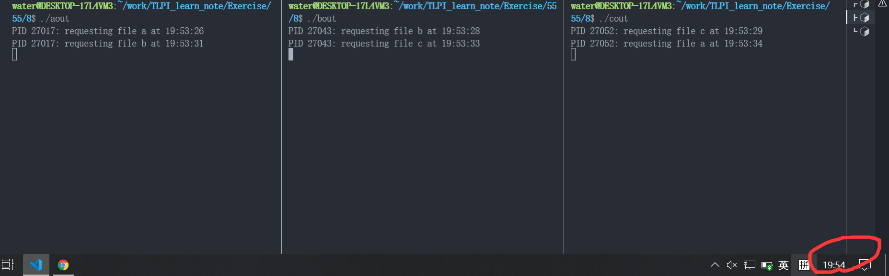 发生死锁

### 55.9

[代码](./Exercise/55/9) 我挂载了-B -o mand 但是没用，还是没死锁不知道为啥，以后研究

<!-- to do -->

### 55.10

---

## CH57 SOCKET: UNIX DOMAIN

### 57.0

[代码](./Exercise/57/0) 这是我随便试试 backlog 未决连接的作用。

### 57.1

[代码](./Exercise/57/1) 发送速率大于接受的时候，前面的是直接成功(未决数据报和之前的未决请求类似，由内核保持在未决数据报的队列)，然后阻塞后面的发送，直到队列处理的一堆后再发送一堆(注意不是处理一个发送一个，而是处理一堆未决数据报之后再一次性发送一堆，这点和未决 connect 不一样,不过很容易理解，为了效率)

### 57.2

[代码](./Exercise/57/2) 使用 linux 抽象 socket 名空间非常简单，单纯把地址的 path 改成第一个是'\0'即可，当然是所有使用该地址的地方都要这样改，不只是 bind。

### 57.3

[代码](./Exercise/57/3)

### 57.4

[代码](./Exercise/57/4) 因为 socket file(包括 linux 抽象 socket 名空间)与 socket 是一对一的，一个 socket 只能 bind 一个 socket file，而一个 socket file 也只能被一个 socket 绑定，所以会出现 ERROR [EADDRINUSE Address already in use] 错误

---

## CH59 SOCKET: Internet DOMAIN

NOTE: 注意下，链接要有.o 或者静态库、动态库代码，别犯傻了。
NOTE: vscode 的 debug 本质是 gdb 套壳，gdb 使用一定要有-g 提供符号等信息，如果没有-g 的话 gdb 体现是没有各种代码信息，vscode 的体现是无法打开函数对应的源文件单步调试，尤其是注意.o/.a/.so 的-g 也是如此，不然是无法在对应的代码里面单步调试的。
NOTE: 注意下是不是调用的是原本就有的静态、共享库代码，根本就不是自己的，而自己的忘记编译了的弱智错误。。。
NOTE: 若 connect 失败则该套接字不再可用，必须关闭，我们不能对这样的套接字再次调用 connect 函数。在每次 connect 失败后，都必须 close 当前套接字描述符并重新调用 socket 。
NOTE: fflush 不一定实现刷新输入流，所以用 while((c = getchar()) != '\n' && c != EOF)最好

### 59.1

[代码](./Exercise/59/1)

### 59.2

[代码](./Exercise/59/2)

### 59.3

[代码](./Exercise/59/3)

### 59.4

[代码](./Exercise/59/4)

### 59.5

[代码](./Exercise/59/5) 结果是会被忽略，因为 a connect b 之后，a 的对等就是 b，internet domain 数据报的情况下会丢弃非对等 socket 发来的数据报

---

## CH60 SOCKET: 服务器设计

NOTE: ubuntu 没有默认安装 inetd，是一个进程监听一个 socket 服务的，从 ps -A 可以看出来一堆这样的进程。
NOTE: conf 没有服务启用的情况下 sudo /etc/init.d/openbsd-inetd start 启动不了正常

### 60.1

[代码](./Exercise/60/1) connect 会阻塞到 accept

### 60.2

[代码](./Exercise/60/2)

---

## CH61 SOCKET: 高级主题

---

## CH62 终端

---

## CH63 其他备选的 I/O 模型

---

## CH64 伪终端

---
